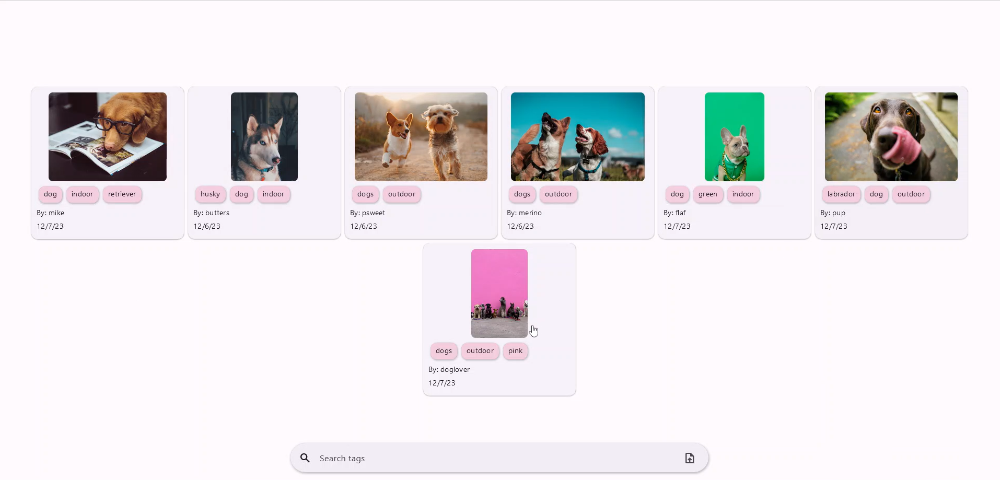
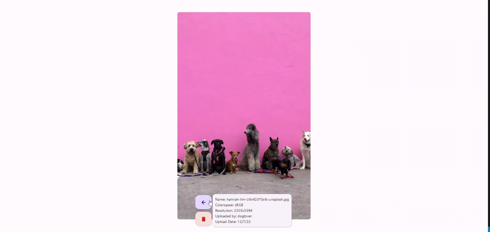
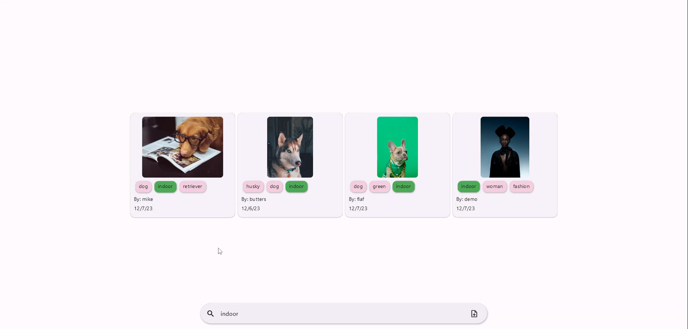
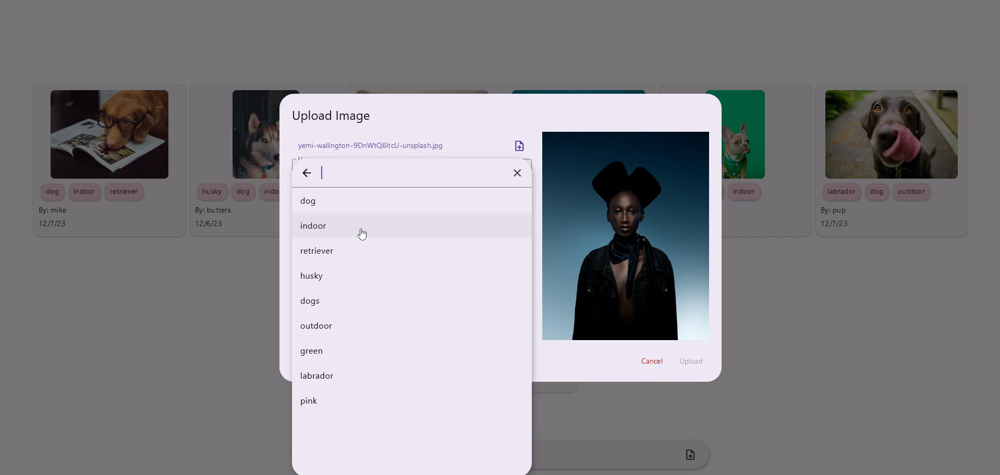
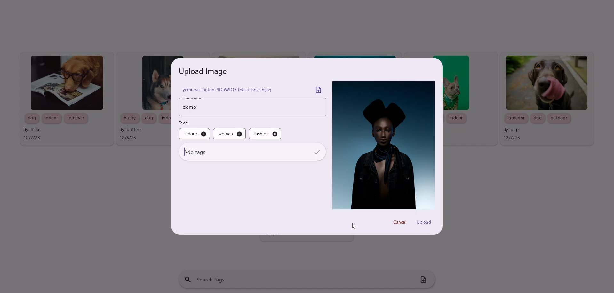

# DATA650 Final Project

This is a simple web app that allows users to upload and save images with an username and tags.

Demo: https://youtu.be/Rt02GCPLRdY

The codebase depends on files that are generated by setting up with AWS Amplify. As such, attempting to build the application without the initial set up will result in errors.

To get this up and running you must do the following:
1. Set up flutter: https://docs.flutter.dev/get-started/install
2. Set up the Amplify CLI: https://docs.amplify.aws/flutter/start/getting-started/installation/
3. Set up DynamoDB: https://docs.amplify.aws/flutter/start/getting-started/generate-model/
    Use the following GraphQL schema:
    ```graphql
    type Image @model @auth(rules: [{ allow: public }]) {
    key: String!
    resolution: String!
    owner: String!
    uploadDate: AWSDate!
    colorspace: String!
    tags: [String]
    }
    ```
4. Set up S3 bucket: https://docs.amplify.aws/flutter/build-a-backend/storage/set-up-storage/
5. Build or test application
    - To build you can use: flutter build web --web-renderer html --release
    - To test you can use: flutter run -d chrome
6. Information on Amplify Hosting: https://docs.aws.amazon.com/amplify/latest/userguide/welcome.html






